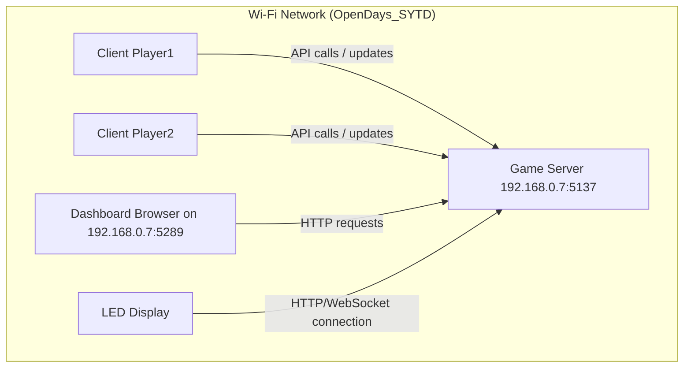

# 🎮 Open Days Interactive Game System

This project is a **networked multiplayer game system** built for open day demonstrations.  
It connects multiple components — a **game server**, **player clients**, a **dashboard**, and an **LED display** — over a local Wi-Fi network.

The system showcases how devices communicate over APIs, real-time events, and IoT connections.

---

## 🧩 Components Overview

| Component | Description |
|------------|--------------|
| **Game Server** | Central hub that manages player states, scores, and LED display communication. All other components connect to it. |
| **Client** | Represents a player’s computer. Each player runs a separate client (`Player1` and `Player2`). Clients communicate with the server and can collect in-game orbs to score points. |
| **Dashboard** | A web-based control and monitoring interface that shows live game data, player states, and LED display status. Display this in a browser for visitors to see. |
| **LED Display (ESP32)** | A physical display connected via Wi-Fi. Shows game status and reacts when players collect orbs. It connects automatically to the server when powered on. |

---

## 🛠️ Network Configuration

All components communicate over the same Wi-Fi network:

- **Wi-Fi SSID:** `OpenDays_SYTD`
- **Password:** `HTLDoesIT!`

> ⚠️ The LED display’s connection code uses a **hardcoded server IP address**:  
> **`192.168.0.7`**
>
> You **must** assign this static IP to the server machine, or recompile and flash the ESP32 firmware with an updated IP.

---

## 🚀 How to Run the System

### 1️⃣ Connect All Devices to Wi-Fi

All computers (server, dashboard, clients, ESP32) must be connected to the same Wi-Fi network:

```
SSID: OpenDays_SYTD
Password: HTLDoesIT!
```

---

### 2️⃣ Start the Game Server

On the server machine:

```bash
cd Server
dotnet run --urls "http://0.0.0.0:5137"
```

- The server listens on port **5137**.
- It should always be started **first** — before clients or the LED display.

> 💡 The LED display connects to `http://192.168.0.7:5137` automatically when powered on.

---

### 3️⃣ Start Player Clients

Run one instance of the client for **each player**.  
Each client must have a **unique player ID** that exactly matches `"Player1"` or `"Player2"`.

#### Player 1
```bash
cd Client
dotnet run Player1 192.168.0.7
```

#### Player 2
```bash
cd Client
dotnet run Player2 192.168.0.7
```

- The **first argument** is the player ID (`Player1` or `Player2`).
- The **second argument** is the server’s IP address.
- Arguments are **positional** — the order matters.

> ⚠️ The LED display relies on the IDs `Player1` and `Player2`.  
> Do not change them.

---

### 4️⃣ Start the Dashboard

On the same machine as the server (recommended):

```bash
cd Dashboard
dotnet run --urls "http://0.0.0.0:5289"
```

Then open a browser and visit:

👉 [http://192.168.0.7:5289](http://192.168.0.7:5289)

The dashboard will show live data from the server.

---

### 5️⃣ Power On the LED Display (ESP32)

Once the **server is running**, turn on the ESP32 LED display.

It will automatically:
- Connect to Wi-Fi (`OpenDays_SYTD`)
- Contact the server at `http://192.168.0.7:5137`
- Display game information

---

## 📋 Recommended Setup

| Role | Machine | Notes |
|------|----------|-------|
| **Server + Dashboard** | 1 PC | Use static IP `192.168.0.7` |
| **Player Clients** | 2 laptops | Run separately for best experience; one can run on the server if necessary |
| **LED Display** | ESP32 | Must connect to the same Wi-Fi as the server |

> ✅ **Start order:**
> 1. Start **Server**
> 2. Power on **LED Display**
> 3. Start **Clients**
> 4. Open **Dashboard** in browser

---

## 🖼️ System Overview Diagram



---

## 💡 Tips

- If the LED display doesn’t light up or show updates:
    - Verify that the **server is running first**
    - Ensure the **server’s IP is 192.168.0.7**
    - Check Wi-Fi connection
- You can recompile the ESP32 firmware with a different IP if needed.

---

## 🧱 Technologies Used

- **C# / .NET 8**
- **ASP.NET Core** for server and dashboard
- **HTTP / REST APIs**
- **ESP32 (C++ / Arduino)** for LED display
- **Local Wi-Fi network** for all communication
